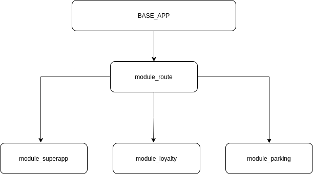

# Flutter test separate packages

## base_app

App principal onde o módulo de rota será acoplado.
Módulo responsável por configurações comuns a todos os outros módulos, tal como Chaves, Cores, Identificação do Shopping, etc...
Se comunica *APENAS* com o módulo de rota. 
## module_route

Módulo de roteamento de módulos.
Reponsável pela navegação entre todos os módulos do projeto.
Se comunica com todos os módulos externos (packages) e com o base_app

## module_loyalty, module_superapp, module_ticket
Módulo de feature.
Se comunica apenas com o módulo de rota (module_route)
Pode ter uma rota própria para navegação de dentro do módulo
(loyalty/profile ou loyalty/tickets ou loyalty/stores, etc...)
Os módulos de feature *não se comunicam entre si* 

